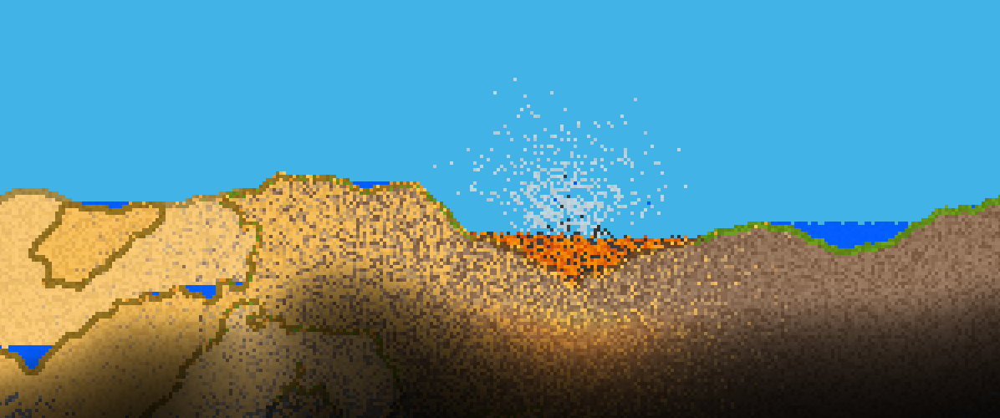
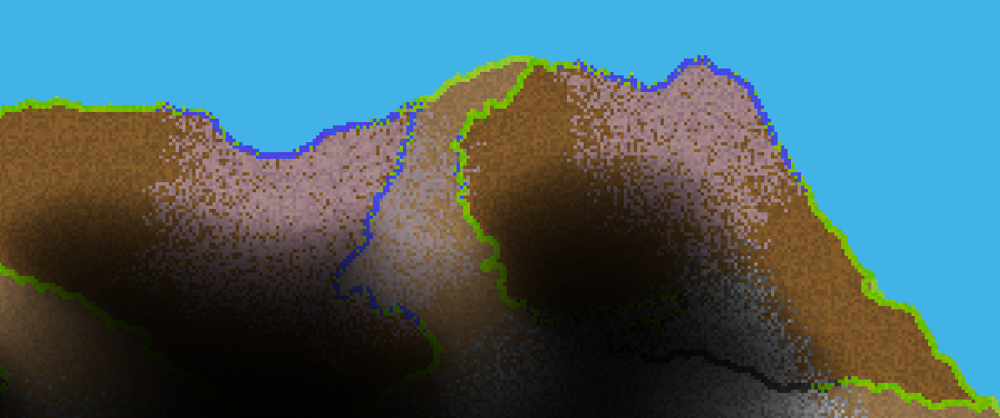
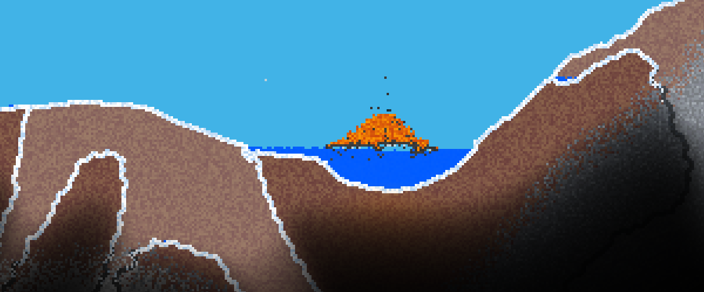

# RealWorld: A tile-based game world simulation demo

## Features:
- 2D endless tile-based world; procedurally generated as the player moves in it
- Falling-sand simulation of liquids, gases, fire and interaction among them
- Dynamic lighting system; supports light-emitting tiles and non-tile-based lights
- Player interaction with the world: add and remove tiles
- WIP: Vegetation made of segments connected with springs
- All aspects, generation; simulation and light propagation, are accelerated on GPU
- Supports Windows (MSVC) and Linux (GCC)

The project is developed using [RealEngine](https://github.com/ZADNE/RealEngine) library.

#### See [video on YouTube](https://youtu.be/XPsG03OpFHg).

## Sample image gallery

#### Evaporation of water dropped into lava and ponds created by precipitation of the steam.

#### An artificial biome spreading across a muddy biome

#### Partially solidified lava dropped into a water pond inside a snowy biome

