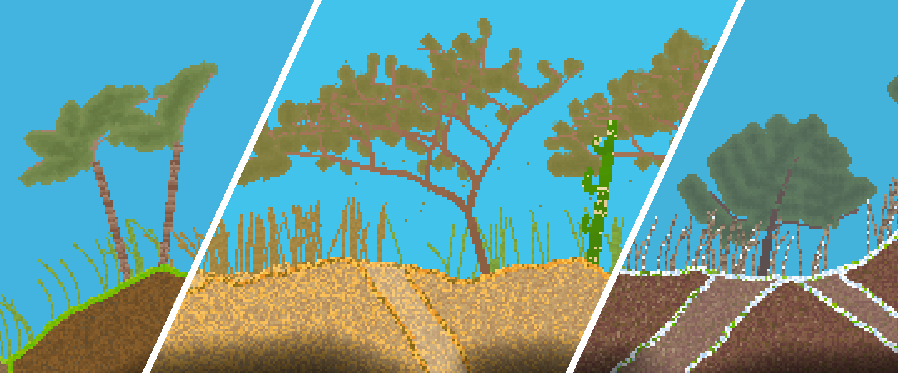
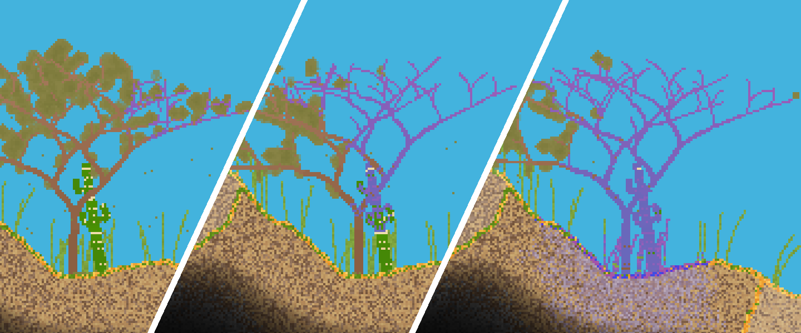

# RealWorld: A tile-based game world simulation demo

## Features:
- 2D endless tile-based world; procedurally generated as the player moves in it
- Falling-sand simulation of liquids, gases, fire and interaction among them
- Trees and bushes that sway in the wind and interact with the cellular simulation
- Dynamic lighting system; supports light-emitting tiles and non-tile-based lights
- Player interaction with the world: add and remove tiles
- All aspects of the game (generation, simulation and light propagation) are accelerated on GPU
- Supports Windows (MSVC) and Linux (GCC)

The project is developed in Vulkan using [RealEngine](https://github.com/ZADNE/RealEngine) library.

## Sample gallery

### See [video on YouTube](https://youtu.be/Am1LrmIBw28).

